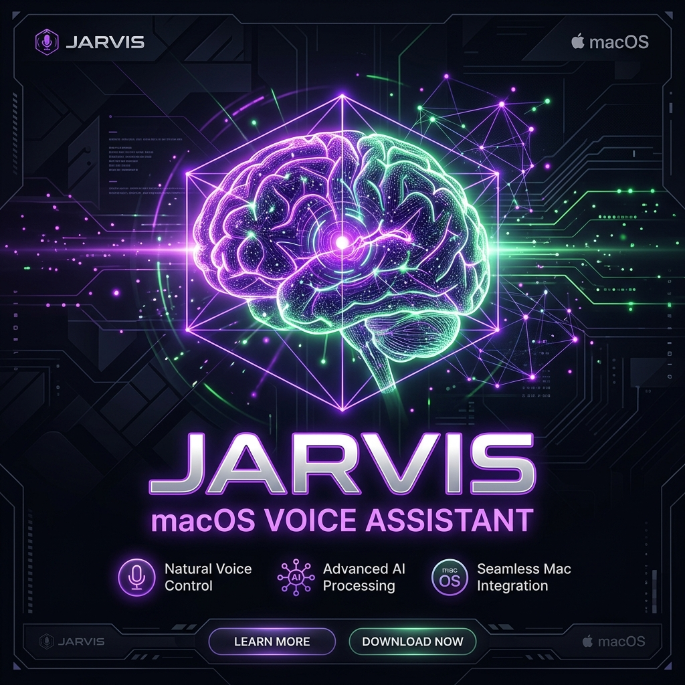
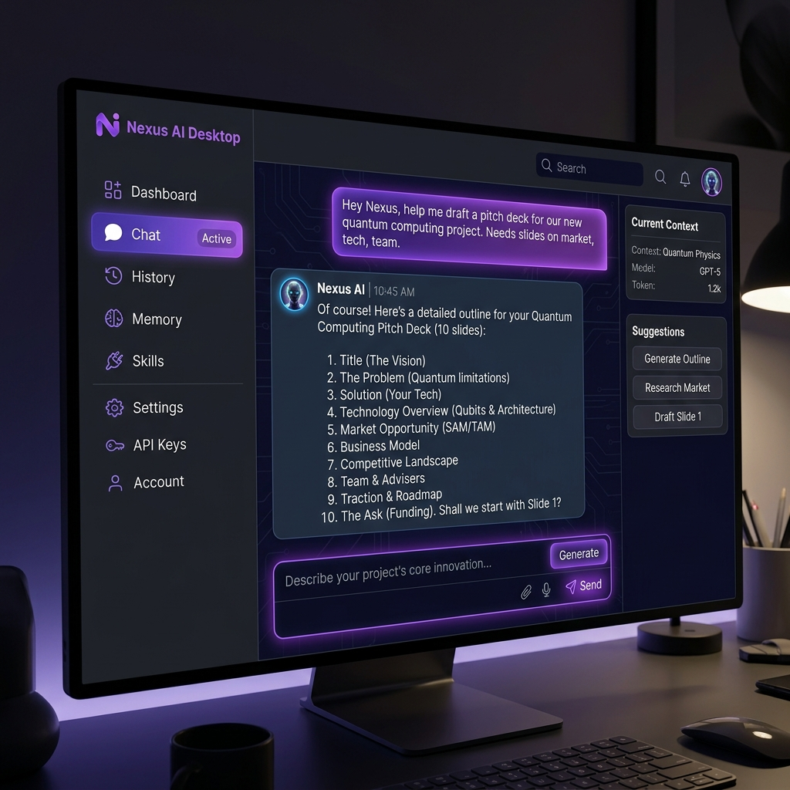
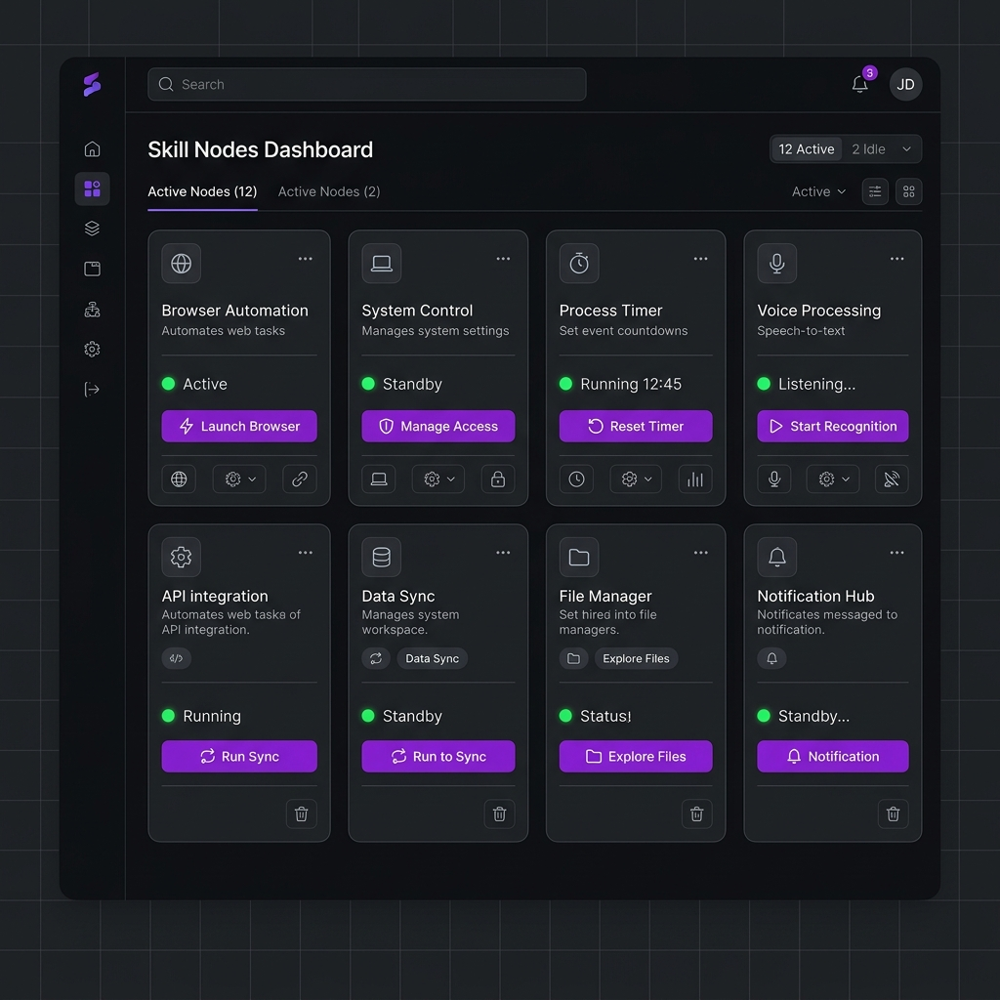

# 🤖 Jarvis — Personal Voice Assistant for macOS

<p align="center">
  
</p>

[](https://www.python.org/downloads/)
[](#-license)
[-lightgrey.svg)](#)
[](https://github.com/Nurislam-Abdimalikov/my-jarvis/actions/workflows/ci.yml)

**Jarvis** — это приватный голосовой ассистент для macOS, который работает локально, активируется фразой "Джарвис", выполняет команды по управлению операционной системой и отвечает вам клонированным голосом (на базе технологии XTTS-v2). Проект разработан на базе архитектуры монорепозитория, объединяющего бэкенд на Python и десктопный клиент на Electron + Next.js.

---

## ✨ Возможности

- 🎙️ **Wake Word активация**: Локальное распознавание с помощью openWakeWord (три модели параллельно с фильтрацией пиков).
- 🗣️ **Локальный STT**: Быстрый и точный перевод речи в текст на базе `faster-whisper`.
- 🧠 **Умный мозг**: OpenAI-совместимый движок (Gemini, Mistral, AIHubMix) с полной поддержкой вызова системных функций (tool calling).
- 🔊 **Клонирование голоса**: Озвучивание ответов голосом актера на базе XTTS-v2 с аппаратным ускорением Apple Silicon (MPS).
- ⚙️ **33 системных навыка**: Управление приложениями, музыкой, браузером, системной громкостью, создание заметок и таймеров.
- 🧠 **Долговременная память**: Хранение фактов о пользователе на базе SQLite с автоматическим поиском контекста.
- 👁️ **Анализ экрана**: Описание содержимого экрана пользователя через мультимодальные модели (Vision).

---

## 📸 Интерфейс

| Панель управления (Чат) | Доступные скиллы |
| --- | --- |
|  |  |

---

## 🧠 Архитектура и стек

Проект реализован в виде монорепозитория:

```txt
my-jarvis/
├── backend/       # Python 3.11 бэкенд (голосовой движок, STT/TTS, интеграция с macOS)
├── frontend/      # Electron + Next.js 16 (React, Tailwind CSS v4, IPC Bridge)
├── docs/          # Подробные гайды (SETUP, ROADMAP, SECURITY)
├── scripts/       # Скрипты развертывания и диагностики окружения
└── docker-compose.yml
```

- **Backend**: Python 3.11, loguru, pytest, ruff, SQLite.
- **Frontend**: Electron, Next.js 16 (App Router), Tailwind CSS v4, Bun.
- **CI/CD**: GitHub Actions (Ruff, pytest, ESLint, Next.js static build check).

---

## 🚀 Быстрый запуск

### Требования
- macOS (рекомендуется Apple Silicon M1/M2/M3 для ускорения моделей)
- Установленные `brew`, `ffmpeg`, `portaudio`
- Пакетный менеджер `Bun`

### Шаг 1. Настройка бэкенда
```bash
make setup               # Создает .venv и ставит зависимости
source .venv/bin/activate # Активирует виртуальное окружение
cp .env.example .env     # Добавьте ваш API ключ (Mistral, Gemini или AIHubMix)
make run                 # Запускает голосового ассистента в фоне
```

### Шаг 2. Запуск десктопного UI
```bash
cd frontend
bun install              # Установка JS зависимостей
bun run dev              # Запуск Next.js + Electron в режиме разработки
```

---

## 🐳 Запуск в Docker (Ollama локальный режим)

Для автономного запуска без облачных API можно запустить локальный сервер моделей Ollama:
```bash
docker-compose up -d     # Запускает Ollama сервер в фоне
```
После этого настройте в `config/config.yaml` бэкенд-движок на работу с локальным хостом Ollama.

---

## 🌐 Деплой веб-версии (Production)

### Frontend (Vercel)
Фронтенд Next.js полностью готов к деплою на **Vercel** как статическое приложение (Static Export):
1. Установите Vercel CLI: `npm i -g vercel`
2. Запустите `vercel` внутри папки `frontend/` и следуйте инструкциям.

### Backend (Render / Railway)
Python API-сервис бэкенда может быть развернут на Render или Railway с использованием предоставленного [Dockerfile](backend/Dockerfile).

---

## 🛣️ Дорожная карта (Roadmap)

Подробный бэклог задач находится в [TASKS.md](TASKS.md).
Основные направления развития:
- [ ] Офлайн режим работы (локальный Whisper + Ollama + локальный TTS).
- [ ] Голосовой барьер (Вмешательство/Barge-in): прерывание речи ассистента при произнесении новой команды.
- [ ] Поддержка управления умным домом через Home Assistant.

---

## 📜 Лицензия

Проект распространяется под лицензией MIT. Разработано Нурисламом Абдималиковым.
